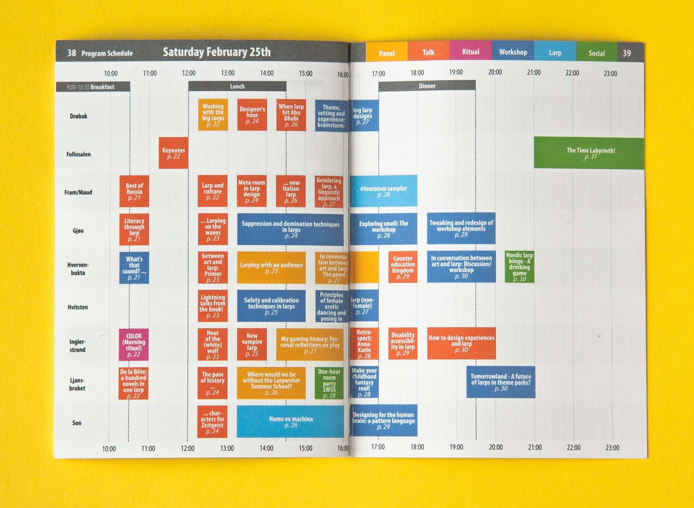

<!-- vim: set ft=markdown spl=en spell :-->

## About the project

A 40 page programme booklet in size A6. The challenge was to make it small
enough to carry in a pocket while keeping the text legible.
I wrote some python scripts to export the programme data from google docs and quickly
import it into the indesign document. For the colour coded boxes for each
programme entry, I used some very unreglemented indesign paragraph style tricks.

## Resources and links

- [booklet as pdf][pdf]
- [booklet as indesign document][indesign]

[pdf]: Knutepunkt-2017-program-booklet.web.pdf
[indesign]: Programblekke-KP2017.idml
