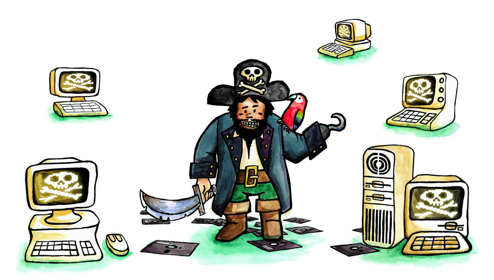

<!-- vim: set ft=markdown spl=en spell :-->
## Game of Love
For an article about *love* as a topic in games. Collage of photo and drawing.

## Science celebrities
For an about celebrity scientist in Norway. Collage of photo and drawing.

## Cheating Pope
For an interview with a video game cheater. Since the person did not want his
picture in print, I drew this cartoon instead. The papal vestments is a
reference to the Norwegian idiom «juksepave» (a cheater).

## Apocalypse Kitten
For an essay about various theories of how the world will come to an end.
Drawing created with Adobe Photoshop.

## Jon Bing
For an interview with science fiction writer, professor and elephant necktie
enthusiast Jon Bing.

## Retro Software piracy
For a story about software piracy in the micro computer era.

