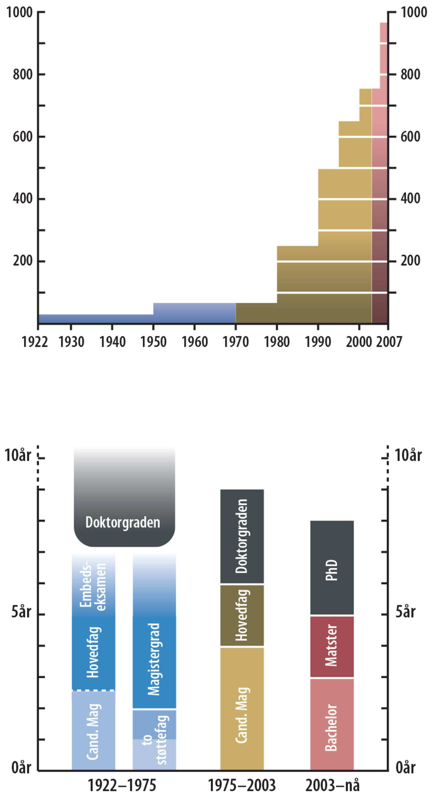
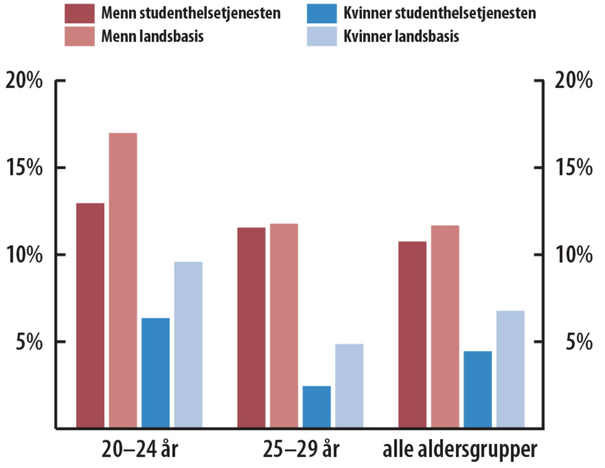
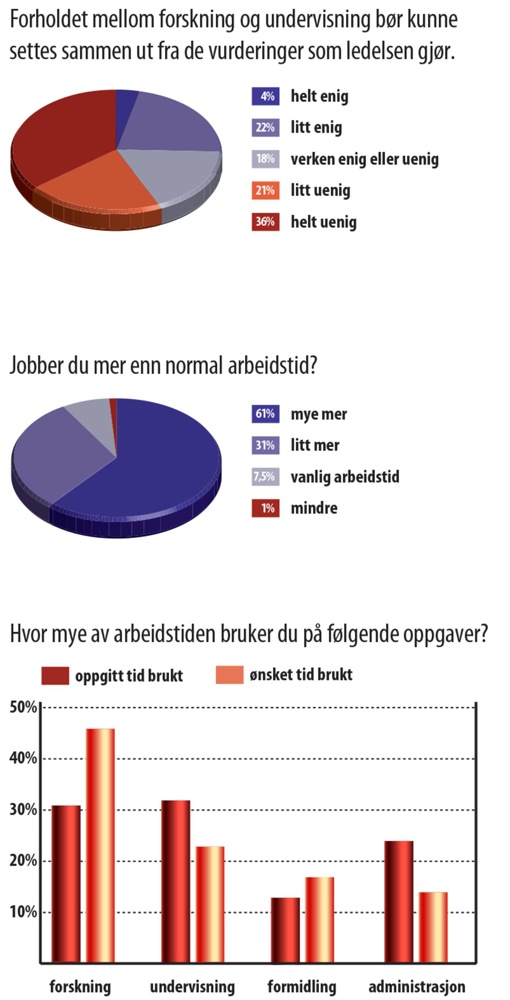

<!-- vim: set ft=markdown spl=en spell :-->
## Higher education grade distributions
From a news article about skewed distribution of grades in different educational
institutions, compared to the proscribed normal distribution.

## Student housing Oslo
Map used in a news article about planned student housing projects.

## Doctorates
Diagram showing the history of doctorate degrees in Norwegion education. The
first histogram shows the number of doctorates awarded each year. The second
diagram shows the prescribed duration of each level of an academic degree.

## Chlamydia
Some standard graphs from a news story.

## Professor survey
Some standard graphs from a news story.

