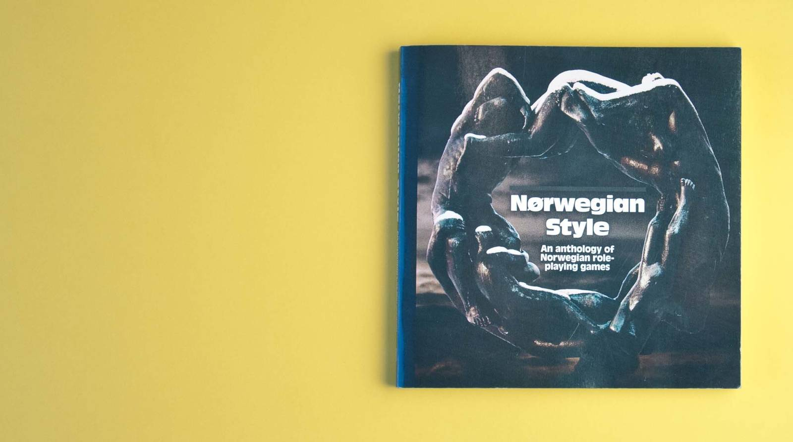
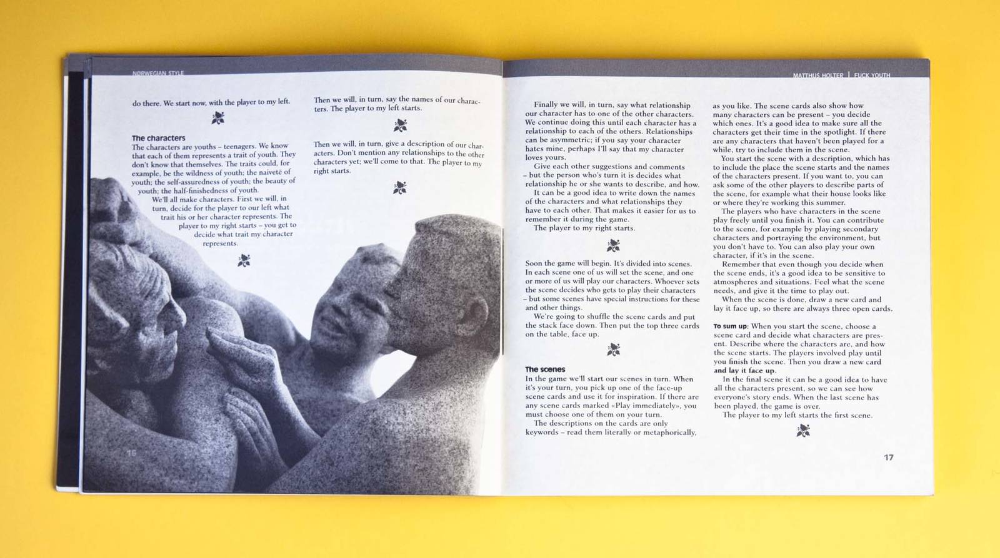
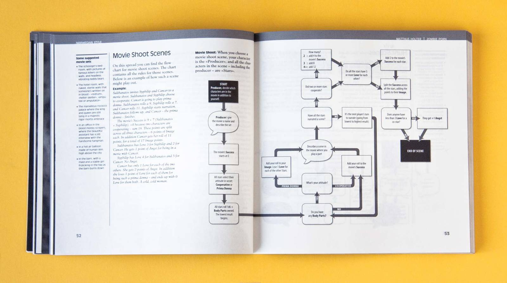
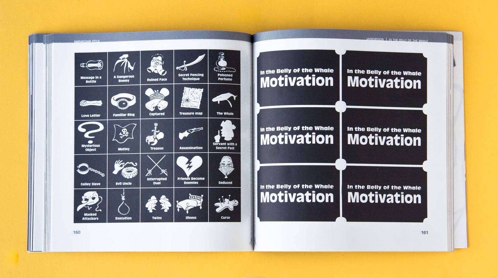
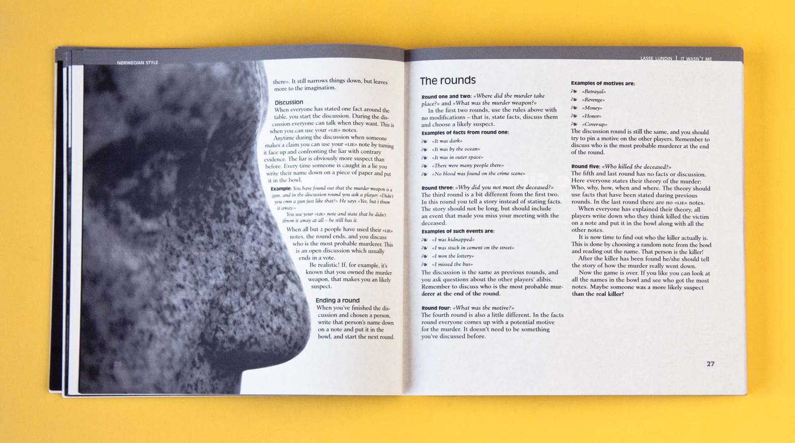
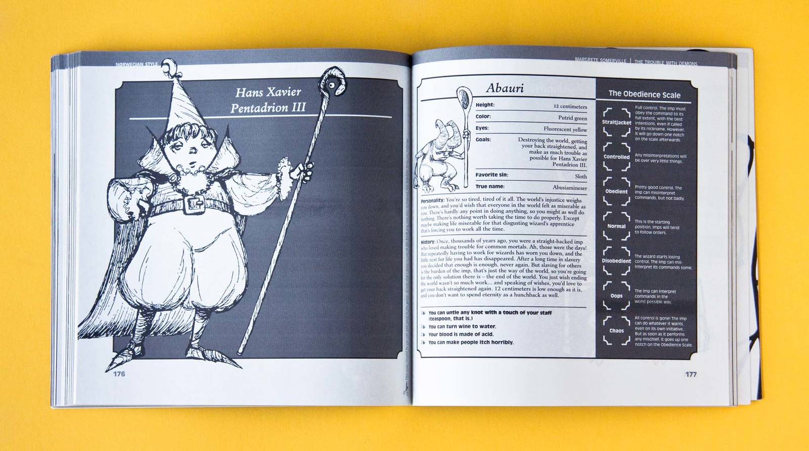
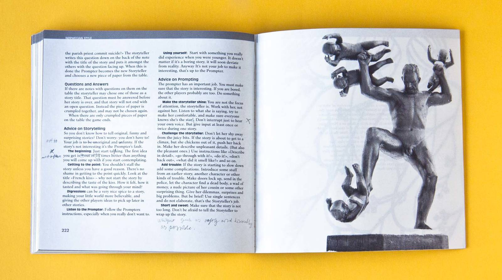
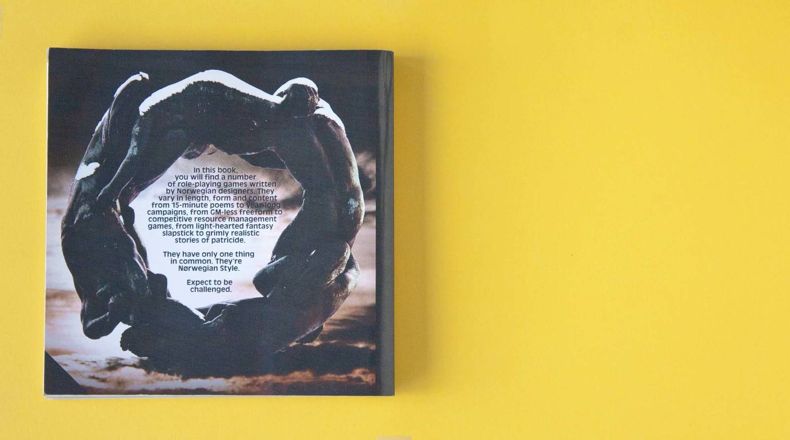

<!-- vim: set ft=markdown spl=en spell :-->

Self published game anthology

## About the project

A 225 page self published anthology of Norwegian role playing games. I did
design and art direction, and made some of the photos and drawings. The photos
are from the Gustav Vigeland sculpture park in Oslo. The book is black and
white, to keep print costs as low as possible.

## Resources and links

[The book is for sale at lulu.com][lulu], a print-on-demand publisher.

[lulu]: http://www.lulu.com/shop/matthijs-holter-and-even-t%C3%B8mte-and-h%C3%A5ken-lid/norwegian-style/paperback/product-15366651.html
