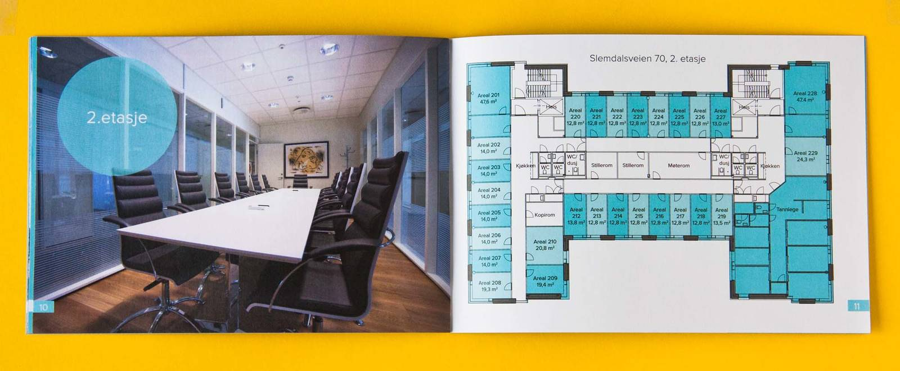

<!-- vim: set ft=markdown spl=en spell :-->
Real estate brochure

## About the project

Pretty standard real estate brochure. The design is based on an existing
brochure that the client had made for a different project. Since they didn't
have the original design files, I recreated it from a printed booklet. I
processed and retouched the photos. I also created a map by importing data
from OpenStreetMap into adobe illustrator to create a custom style, and made
floor plans from technical drawings.

## Resources and links

* [detailed map created in adobe illustrator][pdf]

[pdf]: detailed-map-oslo.pdf
