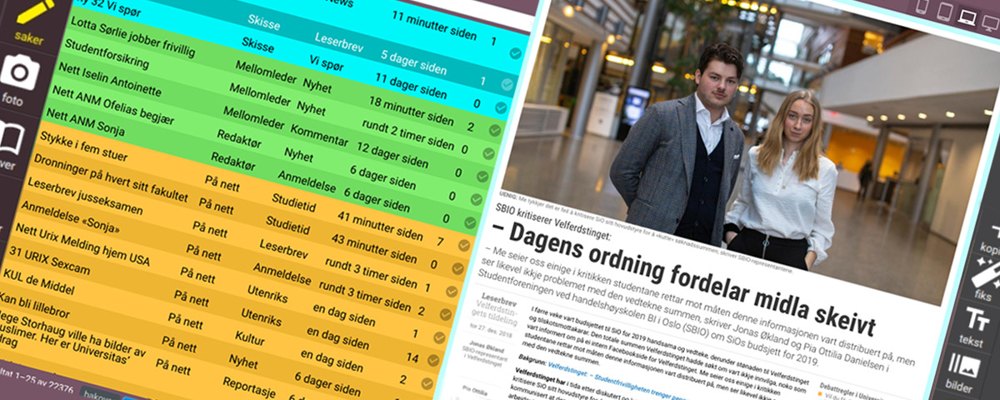

## About the project

I created a content management system which is used both for print content and
web content at the Universitas newspaper.

Like the public frontend of universitas.no, the CMS is a single page application
written with **react.js**. The backend is the same **Django** application and the same
REST api that is used by the public web site.

I use **redux** for state management and **redux saga** for asynchronous effects,
Styling is done with **scss**, widgets and icons are svg, and the layout is done
with a combination of css grid and css flexbox.

Since I had to build a bunch of custom UI widgets, I avoided css frameworks and
widget libraries. The only exception is the very useful [react-select]
component.

This is an application that's only used in-house. There's no public demo
available. (It's possible to clone the repo and run it yourself, of course. The
only requirement is **Docker**. But I have not written any step-by-step
instructions.)

To showcase some of the features of the app, I've captured some videos of the
CMS in use on the production server.

## Front page feed editing

<video autoplay muted loop style="width: 100%" >
  <source src="edit-frontpage.webm" type="video/webm">
  <source src="edit-frontpage.mp4" type="video/mp4">
  Sorry, your browser doesn't support embedded videos.
</video>

The front page editing interface shows a preview of the front page in with zoom
controls, which can be used to emulate how the layout looks on various screen
sizes. The video about story editing further down shows the zoom in action.

This component is implemented using using react.js [portals] to render
elements and stylesheets into an iframe document head and body. Portals also
captures DOM events inside the iframe and bubbles them up to the main react app.

For content that is not yet published, the CMS keeps client state and server
state in sync by http patches the backend api.

In the video above, the auto-sync feature is toggled off, thus changes are only
submitted to the server when the user clicks the save icon.

The styling buttons simply toggles css classes to change font style, layout and
colors in the news feed entries. The size is also changed with css classes,
similar to how it's done in css frameworks like bootstrap. The browser takes
care of layout, since the grid is using native css grid (with a fallback flexbox
layout for older browsers).

The image cropping is controlled with a custom react component that has it's own
[github repo][photocrop] and npm package.

## Photo uploading

<video autoplay muted loop style="width: 100%" >
  <source src="upload-photo.webm" type="video/webm">
  <source src="upload-photo.mp4" type="video/mp4">
  Sorry, your browser doesn't support embedded videos.
</video>

Photographers and editors submit all upload photos and illustrations used in the
newspaper through the CMS. The upload widget reads embedded EXIF tags from the
image file and includes relevant mete data that in the upload form if found.

It's possible to assign photos to stories at the time of uploading. Users are
required to enter a short description and a photo byline for every photo before
they can be uploaded.

A small mini thumb of the image is also sent to the server to check for
potential duplicate images that have already been uploaded. This is done using
perceptual hashing algorithms on the server, and postgresql trigram search. This
approach can find duplicate images even when the images might have been resized,
compressed or edited.

## Story editing and workflow

<video autoplay muted loop style="width: 100%" >
  <source src="prodsys-story.webm" type="video/webm">
  <source src="prodsys-story.mp4" type="video/mp4">
  Sorry, your browser doesn't support embedded videos.
</video>

The basic work flow of the content editing system is based on a legacy web
application that this CMS replaced. The old system was much simpler, but served
its purpose for many years, and other tooling was build around it.

The text markup used is a subset of xtags (an markup format that was originally
used in QuarkXpress, I believe), with some markdown-ish syntax added for
convenience.

This simple markup language is parsed by small parser written in javascript.
The parser produces a node tree which is then passed into the redux state and
rendered into html with react.js.

It turns out that parsing and rendering was fast enough that it's possible to
show a real time preview of the html page while editing text or images in the
CMS.

The same markup text is also used by a suite of custom InDesign plugins that
communicates with the CMS via the rest api. These plugins were also written in
javascript, and I made them after creating the layout and templates for the
print edition of the newspaper.

Since the InDesign suite was made for the legacy CMS, it uses its own api
endpoints emulating the old CMS api.

## Resources and links

- The public site [universitas.no][universitas.no]
- The source code is in the same repo as the public web site
  [github.com/universitas/universitas.no][source]
- Some partial demos as [storybooks]

[universitas.no]: https://universitas.no/
[source]: https://github.com/universitas/universitas.no
[storybooks]: https://universitas.github.io/universitas.no/
[react-select]: https://github.com/JedWatson/react-select
[photocrop]: https://github.com/haakenlid/photocrop
[portals]: https://reactjs.org/docs/portals.html
[drf]: https://www.django-rest-framework.org/

<!-- vim: set ft=markdown spl=en spell :-->
