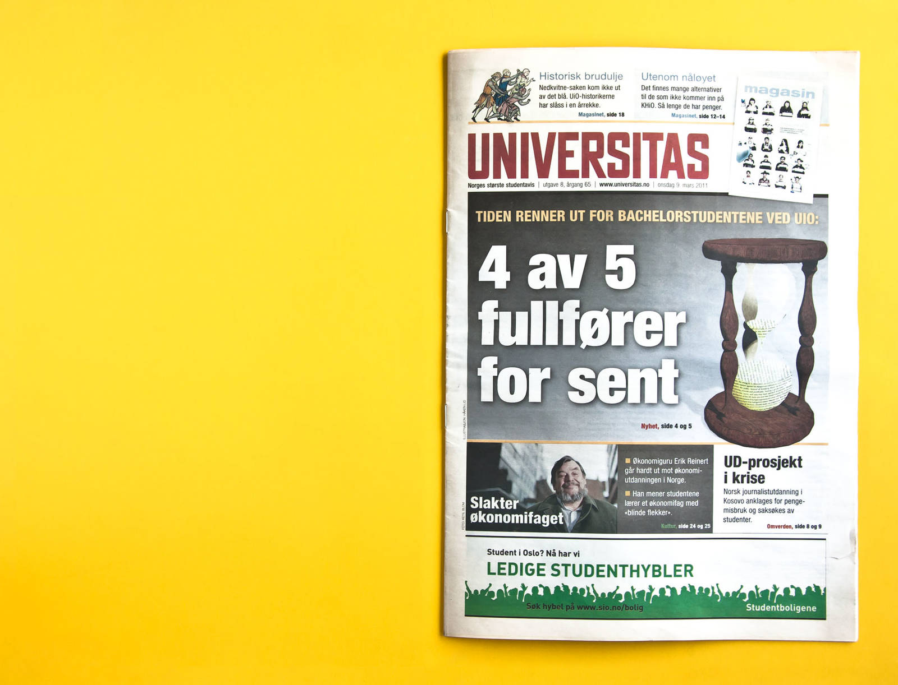
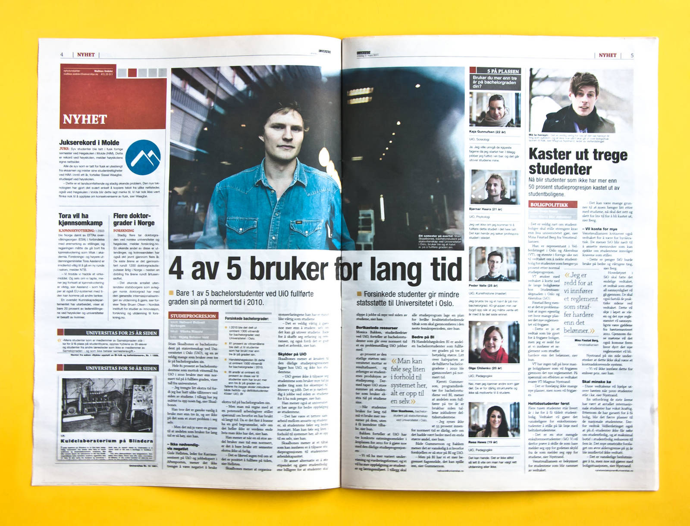
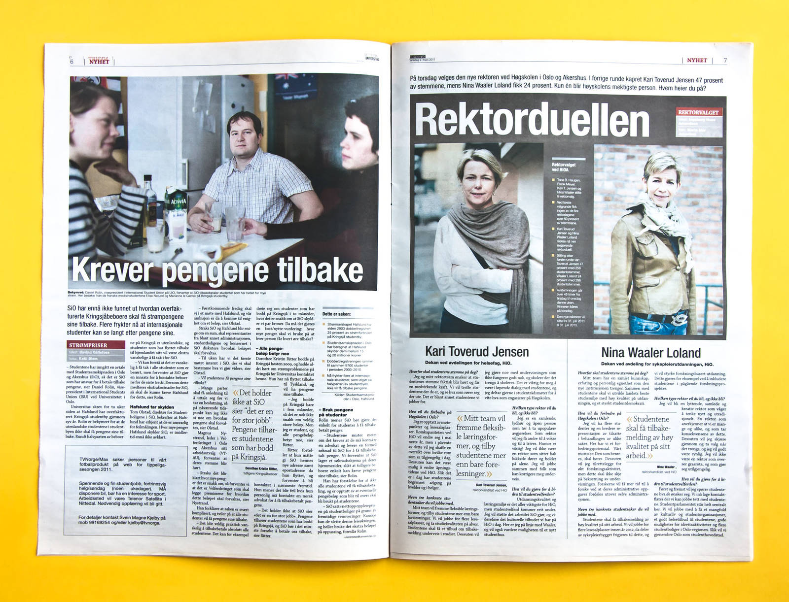
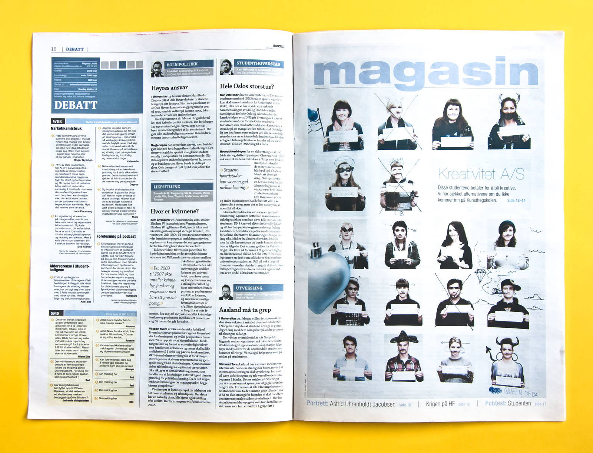
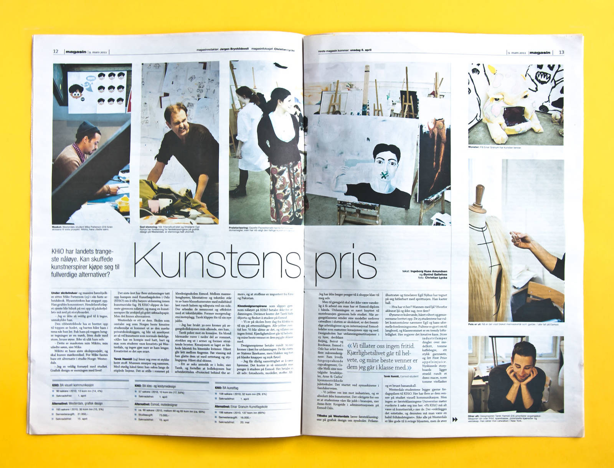
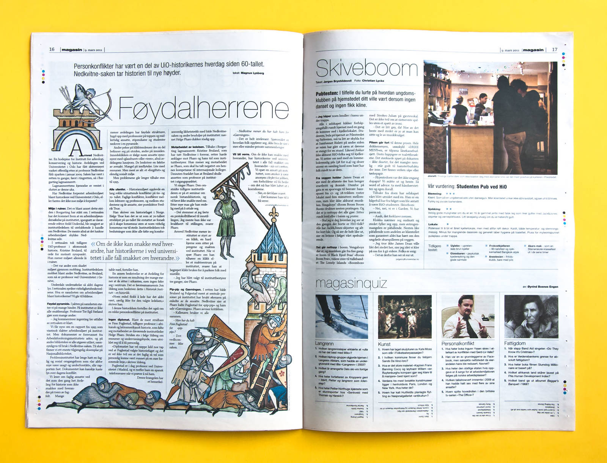
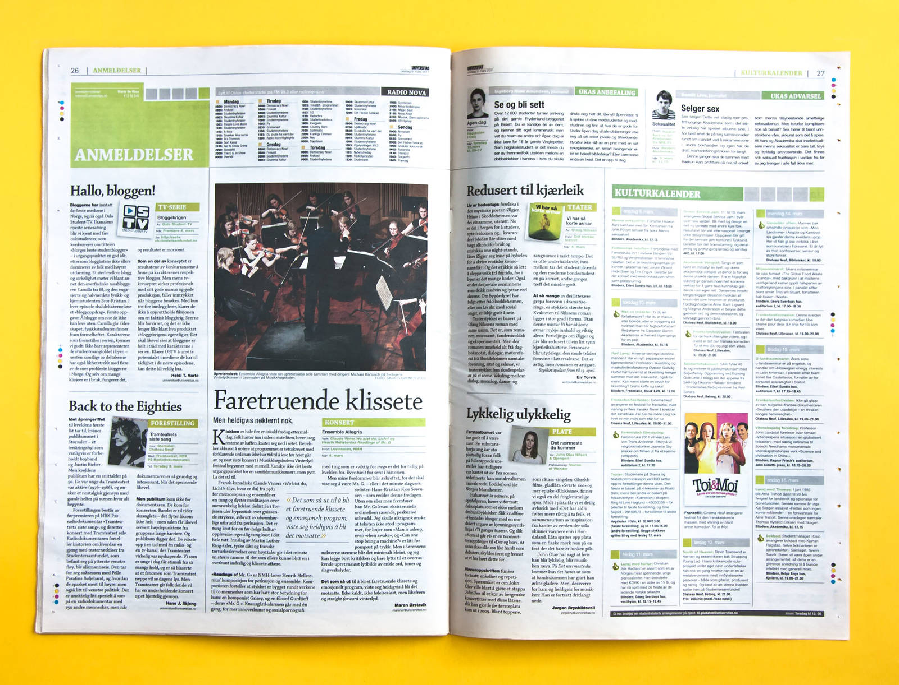
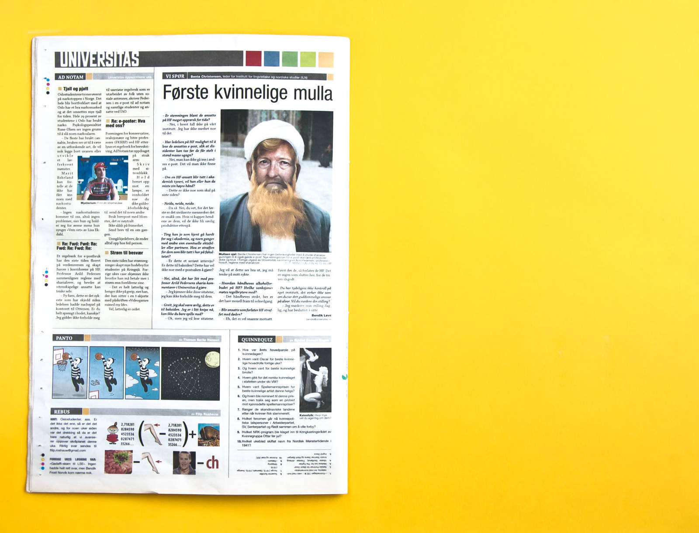

<!-- vim: set ft=markdown spl=en spell :-->

## About the project

I made this newspaper design for a weekly student newspaper. The design has been
in use by the paper since 2009.

## Resources and links

- [online pdf archive][archive] with a couple of hundred issues of the paper.
- [indesign scripts][scripts] used for layout and content management.
- [universitas.no][universitas.no] the online version of the paper, which I also
  designed and built.

[archive]: http://universitas.no/pdf/
[scripts]: https://github.com/universitas/tassendesken
[source code]: https://github.com/universitas/universitas.no
[django]: https://www.djangoproject.com/
[universitas.no]: http://universitas.no/
