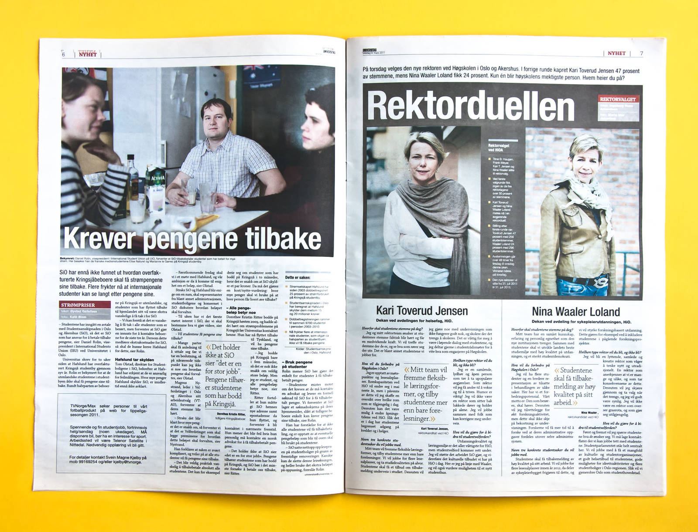
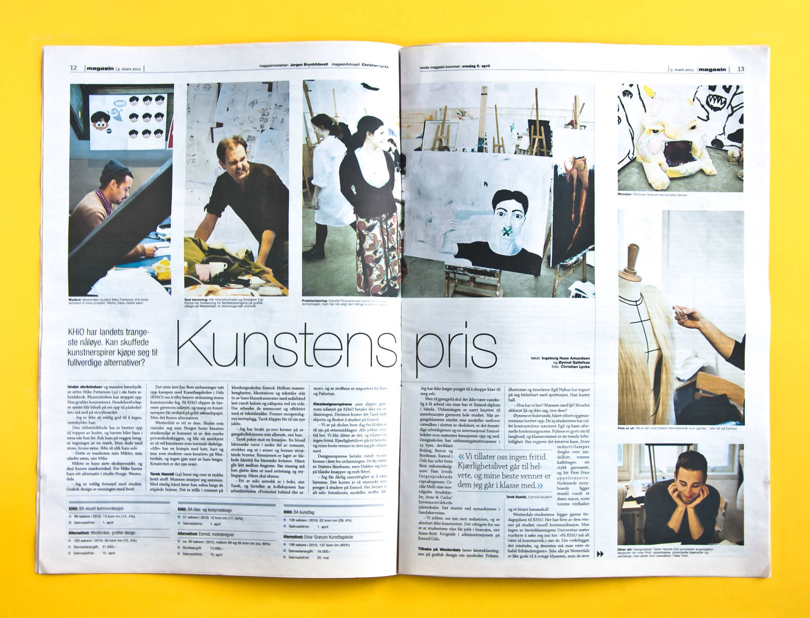

<!-- vim: set ft=markdown spl=en spell :-->
Newspaper design and typography.

In addition to creating the print design, I also made the web site
[universitas.no][universitas.no] using a custom content management system built
using [django][django].

## About the project

I created this newspaper design and programmed a suite of indesign plugins and a
web application and json api for content management. Plugins are written using
Adobe ExtendScript (basically ES3), other tools are written in bash, python etc.

## Resources and links

* [pdf archive][archive] with a couple of hundred issues of the paper.
* [indesign scripts][scripts] used for layout and content management.
* [web site source code][source code] for the online version of the paper.

[archive]: http://universitas.no/pdf/
[scripts]: https://github.com/universitas/tassendesken
[source code]: https://github.com/universitas/universitas.no
[django]: https://www.djangoproject.com/
[universitas.no]: http://universitas.no/
