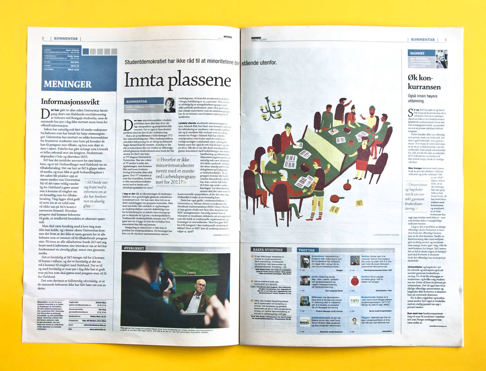
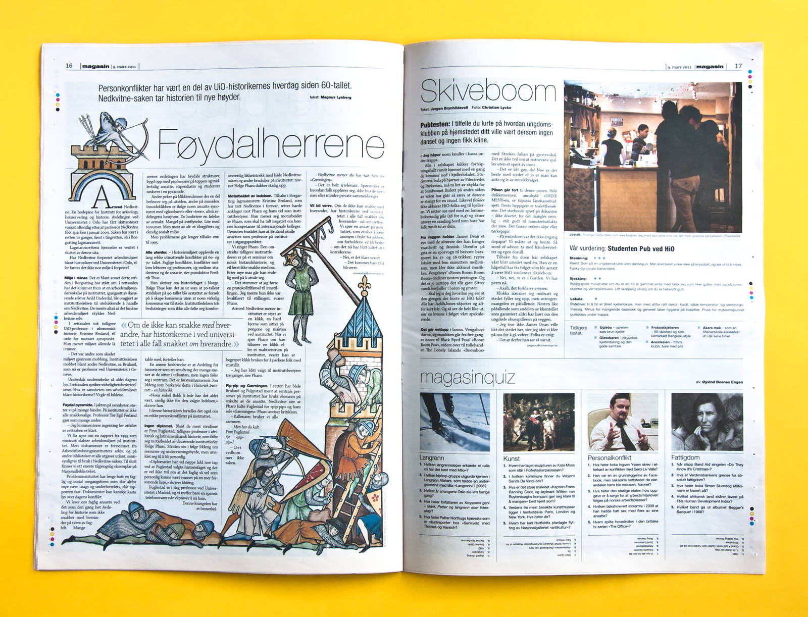

<!-- vim: set ft=markdown spl=en spell :-->
Newspaper design and typography

## About the project

I created this newspaper design and programmed a suite of indesign plugins and a
web application and json api for content management.

I also designed and programmed the online version of the newspaper.

## Resources and links

* [pdf archive][archive] with a couple of hundred issues of the paper.
* [indesign scripts][scripts] used with the design and content management.
* [web site source code][source code] for the online version of the paper.

[archive]: http://universitas.no/pdf/
[scripts]: https://github.com/universitas/tassendesken
[source code]: https://github.com/universitas/universitas.no
