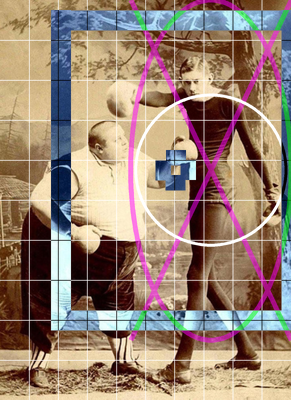
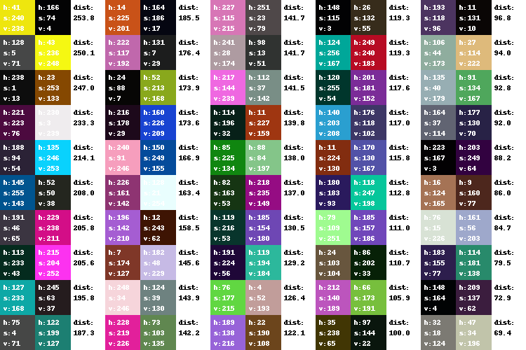

imports
-------

```python
from PIL import Image, ImageDraw
from io import BytesIO
from IPython.display import HTML, display
import random
import itertools
import glob
import cv2
# import colorsys
import base64
```


Welcome to image cropping
-------------------------

```python
class BoundingBox:

    """Rectangular bounding box"""

    def __init__(self, left, top, right, bottom):
        assert top < bottom and left < right, "Width and height must be greater than zero"
        self.left = left
        self.top = top
        self.right = right
        self.bottom = bottom

    def __repr__(self):
        return (
            '{self.__class__.__name__}'
            '(left={self.left}, top={self.top}, right={self.right}, bottom={self.bottom})'
        ).format(self=self)

    def __add__(self, other):
        """BoundingBox containing both boxes"""
        return self.__class__(
            left=min(self.left, other.left),
            top=min(self.top, other.top),
            right=max(self.right, other.right),
            bottom=max(self.bottom, other.bottom),
        )

    def __radd__(self, other):
        return self

    def __and__(self, other):
        """Intersection"""
        return self.__class__(
            left=max(self.left, other.left),
            top=max(self.top, other.top),
            right=min(self.right, other.right),
            bottom=min(self.bottom, other.bottom),
        )

    def __contains__(self, point):
        x, y = point
        return self.top <= x <= self.bottom and self.left <= y <= self.right

    def __mul__(self, factor):
        """Multiply all dimensions by factor"""
        x, y = self.center
        w, h = self.width * factor, self.height * factor 
        return self.__class__(
            left=x - w / 2,
            top=y - h / 2 ,
            right=x + w / 2,
            bottom=y + h / 2,
        )

    @property
    def width(self):
        return self.right - self.left

    @width.setter
    def width(self, value):
        self.left, self.right = (self.center[0]+x*value*.5 for x in [-1,1])

    @property
    def height(self):
        return self.bottom - self.top

    @height.setter
    def height(self, value):
        self.top, self.bottom = (self.center[1]+x*value*.5 for x in [-1,1])

    @property
    def diagonal(self):
        """Length of diagonal"""
        return (self.width**2 + self.height**2)**0.5

    @property
    def ratio(self):
        """Aspect ratio"""
        return self.width / self.height

    @property
    def size(self):
        """Area of BoundingBox"""
        return self.width * self.height

    @property
    def center(self):
        """Center point of box (x, y)"""
        return (self.right + self.left) / 2, (self.bottom + self.top) / 2

    @property
    def geometry(self):
        return self.left, self.top, self.right, self.bottom
    
    def inside(self, other, fit=True):
        limit = 1e-15 # floating point math requires some imprecision
        if not fit:
            assert self.width - other.width > -limit
            assert self.height - other.height > -limit
            
        width = min(self.width, other.width, other.ratio * self.height) 
        height = width * other.ratio**-1.0
        left = sorted([self.left, self.right - width, other.center[0] - width/2])[1]
        top = sorted([self.top, self.bottom - height, other.center[1] - height/2])[1]
        right = left + width 
        bottom = top + height
        return self.__class__(left, top, right, bottom)
            
    def outside(self, other, fit=True):
        limit = 1e-15 # floating point math requires some imprecision
        if not fit:
            assert other.width - self.width > -limit
            assert other.height - self.height > -limit
            
        width = max(self.width, other.width, other.ratio * self.height) 
        height = width * other.ratio**-1.0
        left = sorted([self.left, self.right - width, other.center[0] - width/2])[1]
        top = sorted([self.top, self.bottom - height, other.center[1] - height/2])[1]
        right = left + width
        bottom = top + height 
        return self.__class__(left, top, right, bottom)

class ImageBoundingBox(BoundingBox):

    """Bounding box with absolute pixel values"""

    @classmethod
    def from_relative(cls, box, image_width, image_height, contain=True):
        if contain:
            box &= BoundingBox(0, 0, 1, 1)

        return cls(
            left=box.left * image_width,
            top=box.top * image_height,
            right=box.right * image_width,
            bottom=box.bottom * image_height,
        )

    def to_relative(self, image_width, image_height, contain=True):
        """Convert to a RelativeBoundingBox"""
        box = BoundingBox(
            left=self.left / image_width,
            top=self.top / image_height,
            right=self.right / image_width,
            bottom=self.bottom / image_height,
        )
        if contain:
            box &= BoundingBox(0, 0, 1, 1)

        return box

```


```python
class BaseCropEngine:

    def __init__(self, padding=0.6):
        self.bounds = BoundingBox(0, 0, 1, 1) * padding

    @staticmethod
    def opencv_image(image_file, size, color=cv2.COLOR_BGR2GRAY):
        cvimg = cv2.imread(image_file)
        height, width = cvimg.shape[:2]
        if width > height:
            height, width = size * height // width, size
        else:
            height, width = size, size * width // height
        cvimg = cv2.resize(cvimg, (width, height))
        return cv2.cvtColor(cvimg, color)

    def find_features(self, image_file):
        return [self.bounds, self.bounds * 0.5]


class FeatureCropEngine(BaseCropEngine):

    def __init__(self, n=10, padding=1.2, size=200, extra_kwargs=None):
        self.imagesize = size
        self.padding = padding
        arguments = dict(
            nfeatures=n,
            scaleFactor=1.5,
            patchSize=self.imagesize // 10,
            edgeThreshold=self.imagesize // 10,
            WTA_K=2,
            scoreType=cv2.ORB_FAST_SCORE,
        )
        if extra_kwargs:
            arguments.update(extra_kwargs)
        self.feature_detector = cv2.ORB_create(**arguments)

    def find_features(self, image_file):
        cvimg = self.opencv_image(image_file, self.imagesize)
        height, width = cvimg.shape[:2]

        keypoints, desc = self.feature_detector.detectAndCompute(
            image=cvimg, mask=None)
        keyfunc = lambda kp: kp.size * kp.response * kp.response
        keypoints = sorted( keypoints,  key=keyfunc, reverse=True )
        
        boxes = []
        for keypoint in keypoints:
            radius = keypoint.size / 2
            x = keypoint.pt[0]
            y = keypoint.pt[1]
            box = ImageBoundingBox(
                left=x-radius,
                top=y-radius, 
                right=x+radius, 
                bottom=y+radius,
            )
            box *= self.padding
            box = box.to_relative(width, height) 
            boxes.append(box)
            
        return boxes


class FaceCropEngine(BaseCropEngine):

    cascade_files = '/usr/share/opencv/haarcascades/haarcascade_{}.xml'
    default_classifiers = ['frontalface_default', 'profileface']
    
    def __init__(self, classifiers=None, n=100, size=400, padding=1.3):
        if classifiers is None:
            classifiers = self.default_classifiers[:]
        self.classifiers = []
        for classifier_name in classifiers:
            cascade_file = self.cascade_files.format(classifier_name)
            self.classifiers.append(cv2.CascadeClassifier(cascade_file))
            
        self.imagesize = size
        self.minsize = (self.imagesize // 15, self.imagesize // 15)
        self.padding = padding
        self.number = n

    def find_features(self, image_file):
        cvimg = self.opencv_image(image_file, self.imagesize)
        height, width = cvimg.shape[:2]
        
        faces = []
        for classifier in self.classifiers:
            faces.extend(
                classifier.detectMultiScale(
                    cvimg, 
                    minSize=self.minsize, 
                    minNeighbors=8,
                ))
        boxes = []
        for l, t, w, h in faces:
            box = ImageBoundingBox(left=l, top=t, right=l + w, bottom=t + h)
            box *= self.padding
            box = box.to_relative(width, height)
            boxes.append(box)
            
        boxes = sorted(boxes, key=lambda b: b.size, reverse=True)
        return boxes[:self.number]


class HybridEngine(BaseCropEngine):

    def __init__(self, padding=1.3):
        self.face_engine = FaceCropEngine(padding=padding)
        self.feature_engine = FeatureCropEngine(padding=padding)
        self.extra_engine = FeatureCropEngine(n=5, padding=padding/2)

    def find_features(self, image_file, plot=None):
        features = self.face_engine.find_features(image_file) 
        if not features:
            return self.feature_engine.find_features(image_file)
        if sum(features).size < 0.15:
            features += self.extra_engine.find_features(image_file)
        return features
```


```python
from PIL import Image, ImageOps, ImageDraw

def plot_box_on_image(image, box=None, color='white', shape='b', grid=2, width=1, invert=False, antialias=2):
    width = width * antialias / 2
    if box is None:
        box = BoundingBox(0,0,1,1)
    if isinstance(box, ImageBoundingBox):
        box = ImageBoundingBox.to_relative(box, image.width, image.height)
    overlay = Image.new(
        size=[int(dim * antialias) for dim in image.size],
        mode='RGBA', color=(0,0,0,0))
    
    box = ImageBoundingBox.from_relative(box, overlay.width, overlay.height)
    draw = ImageDraw.Draw(overlay)
    
    def line(*args):
        draw.line(args, fill=color, width=int(2*width))
    
    if 'o' in shape:
        b0 = [v - width for v in box.geometry]
        b1 = [v + width for v in box.geometry]
        draw.ellipse(b0[:2] + b1[2:], fill=color)
        draw.ellipse(b1[:2] + b0[2:], fill=(0,0,0,0))
        
    if 'b' in shape:
        l, t, r, b = box.geometry
        line(l+width, t, r-width, t)
        line(l+width, b, r-width, b)
        line(l, t-width, l, b+width)
        line(r, t-width, r, b+width)
        
    if 'x' in shape:
        line(box.left, box.top, box.right, box.bottom)
        line(box.right, box.top, box.left, box.bottom)
        
    if '+' in shape:
        x, y = box.center
        length = 20*antialias
        gap = 5*antialias
        line(x-length, y, x-gap, y)
        line(x+length, y, x+gap, y)
        line(x, y-length, x, y-gap)
        line(x, y+length, x, y+gap)
        
    if grid and '#' in shape:
        divs = grid + 1
        dw = box.width / divs
        dh = box.height / divs
        for n in range(1, divs):
            x = box.left + n * dw
            y = box.top + n * dh
            line(box.left, y, box.right, y)
            line(x, box.top, x, box.bottom)
            
    overlay = overlay.resize(image.size, Image.LANCZOS)
    mask = overlay
    if invert:
        overlay = ImageOps.invert(image)
    image.paste(overlay, mask=mask)

def test_box_and_plotting(image_file):
    image = Image.open(image_file)
    image.thumbnail((600, 400))
    box = None
    #plot_box_on_image(image, box, width=.4, shape='#', color='white', grid=99, antialias=5)
    plot_box_on_image(image, box, width=.8, shape='#', color='white', grid=9, antialias=3)
    box = BoundingBox(.6,.1,.9,.6) 
    box = ImageBoundingBox.from_relative(box * 2, image.width, image.height) 
    plot_box_on_image(image, box, width=5, shape='ox', color=(256,0,256,128), antialias=4)
    box.height = box.width = 300
    plot_box_on_image(image, box * 0.5, width=3, shape='o', antialias=4)
    plot_box_on_image(image, box, width=20, shape='b+', invert=True)
    return image

test_box_and_plotting('./pinterest/boxers.jpg')
```





```python
def close_crop(image, geometry, center, shape):
    cx = center[0] * image.width 
    cy = center[1] * image.height
    cropbox = ImageBoundingBox.from_relative(
        BoundingBox(*geometry), image.width, image.height)
    
    output_ratio = shape[0] / shape[1]
    image_ratio = image.width / image.height

    if image_ratio > output_ratio:
        w1 = image.height * output_ratio
    else:
        w1 = image.width
        
    if cropbox.ratio > output_ratio:
        w2 = cropbox.width
    else:
        w2 = cropbox.height * output_ratio

    width = min(w1, w2)
    height = width / output_ratio
    
    if width > cropbox.width:
        ccx = [width / 2, image.width - width / 2, cropbox.center[0]]
    else:
        ccx = [cropbox.left + width / 2, cropbox.right - width / 2, cx ]

    if height > cropbox.height:
        ccy = [height / 2, image.height - height / 2, cropbox.center[1]]
    else:
        ccy = [cropbox.top + height / 2, cropbox.bottom - height / 2, cy ]

    cx, cy = sorted(ccx)[1], sorted(ccy)[1]

    box = BoundingBox(
        left = cx - width / 2,
        right = cx + width / 2,
        top = cy - height / 2,
        bottom = cy + height / 2,
    )
    return box
```


```python
def image_to_html_img(image, _id=None, style={}):
    b = BytesIO()
    image.convert('RGB').save(b, 'PNG')
    raw = b.getvalue()
    attrs = {}
    if style:
        attrs['style'] = '"{}"'.format(
            ';'.join('{}: {}'.format(key, value) for key, value in style.items()))
    if _id:
        attrs['id'] = _id
        attrs['title'] = _id
    data = base64.encodebytes(raw).decode('ascii').replace("\n", "")
    attrs['src'] = '"data:image/png/;base64,{}"'.format(data)
    html = ''.format(
        ' '.join('{}={}'.format(k, v) for k, v in attrs.items()))
    return html

tassenbilder = glob.glob('/srv/fotoarkiv_universitas/2014/**/*.jpg')
pinterestimages = glob.glob('./pinterest/*.jpg')
flickrimages = glob.glob('./crop-photos/*.jpg')
```


```python
def make_html(images):
    html = []
   
    for image in images:
        html.append(image_crops_to_htmldiv(image))
        print('#', end = '')
    return '\n'.join(html)

def image_crops_to_htmldiv(image):
    height = 150
    ratios = 0.5, 1, 2
    widths = (int(height * ratio) for ratio in ratios)
    center = image.features[0].center
    image_id = image.filename
    cropbox = sum(image.features) * 1.2
    crop_thumbs = []
    feature_thumbs = []
    for width in widths:
        shape = (width, height)
        box = close_crop(
            image = image,
            geometry = cropbox.geometry,
            center = center,
            shape = shape,
        )
        thumb = image.crop([int(val) for val in box.geometry]).resize(shape)
        crop_thumbs.append(image_to_html_img(thumb))
            
    feature_thumb_size = [int(height*.5)] * 2
    imageclone = image.copy()  
    image.thumbnail((height*3, height*3))     
    plot_box_on_image(image, cropbox, color='white', width=2, shape='b', antialias=4)
    plot_box_on_image(image, image.features[0], color='yellow', width=1, shape='+', antialias=4)
            
    for index, feature in enumerate(image.features):
        box = ImageBoundingBox.from_relative(feature, imageclone.width, imageclone.height)
        thumb = imageclone.crop([int(v) for v in box.geometry])
        thumb.thumbnail(feature_thumb_size)
        plot_box_on_image(image, feature, shape='o', antialias=4)
        plot_box_on_image(thumb, None, shape='+', antialias=4)
        feature_id = '{}-{}'.format(image_id, index)
        feature_thumbs.append(image_to_html_img(thumb, _id=feature_id))
            
    SNIPPET = """
    <div class="group">
        <div class="thumbs">
            <div class="features">{features}</div>
        </div>
        <div class="sourceimage">{sourceimage}</div>
    </div>
    """
    
    sourceimage = image_to_html_img(image, _id=image_id) 
    html = SNIPPET.format(
        crops = ''.join(crop_thumbs),
        features = ''.join(feature_thumbs),
        sourceimage=sourceimage,
    )
    return html

```


```python
def main(n=10, image_files=None, random_order=False, indexes=None):
    resize = 800, 800
    crop_engine = HybridEngine(padding=1.5)
    
    if image_files is None:
        image_files = pinterestimages
        
    if random_order:
        random.shuffle(image_files)
   
    image_files = image_files[:n]
    
    print('>'*len(image_files) + '*'*len(image_files))
    
    images = []
    for image_file in image_files:
        im = Image.open(image_file).convert('RGB')
        im.filename = image_file
        im.thumbnail(resize)
        im.title = '{1}x{2}  {0}'.format(image_file, im.width, im.height)
        im.features = crop_engine.find_features(image_file)
        images.append(im)
        print('<', end = '')
    
    return make_html(images)
  
html = main(5, tassenbilder, random_order=True)
HTML(html)
```
<section class=html>
<div class="group"><div class="thumbs">
<div class="features"></div>
</div>
<div class="sourceimage"></div>
</div>


<div class="group">
<div class="thumbs">
<div class="features"></div>
</div>
<div class="sourceimage"></div>
</div>


<div class="group">
<div class="thumbs">
<div class="features"></div>
</div>
<div class="sourceimage"></div>
</div>


<div class="group">
<div class="thumbs">
<div class="features"></div>
</div>
<div class="sourceimage"></div>
</div>


<div class="group">
<div class="thumbs">
<div class="features"></div>
</div>
<div class="sourceimage"></div>
</div>

</section>


```python
STYLES = """
.group {
    display: flex;
    border-bottom: 1px solid #555;
}
.output_area .rendered_html .group img {
    margin: 2px;
}
.features img {
    border-radius: 50%;
}
.thumbs { 
    display: flex;
    flex-direction: column;
}
.crops {
    display: flex;
}
.features { 
    display: flex;
}
.sourceimage { 
    height: 220px;
}
.rendered_html .sourceimage img {
    height: 100%;
    width: auto;
}
p.test { color: white; background: blue; }
"""

def css():
    return HTML('<style>{0}</style><p class="test">{1}</p>'.format(STYLES, STYLES.replace('\n', '<br>')))
css()
```


<style>
.group {
    display: flex;
    border-bottom: 1px solid #555;
}
.output_area .rendered_html .group img {
    margin: 2px;
}
.features img {
    border-radius: 50%;
}
.thumbs { 
    display: flex;
    flex-direction: column;
}
.crops {
    display: flex;
}
.features { 
    display: flex;
}
.sourceimage { 
    height: 220px;
}
.rendered_html .sourceimage img {
    height: 100%;
    width: auto;
}
p.test { color: white; background: blue; }
</style><p class="test"><br>.group {<br>    display: flex;<br>    border-bottom: 1px solid #555;<br>}<br>.output_area .rendered_html .group img {<br>    margin: 2px;<br>}<br>.features img {<br>    border-radius: 50%;<br>}<br>.thumbs { <br>    display: flex;<br>    flex-direction: column;<br>}<br>.crops {<br>    display: flex;<br>}<br>.features { <br>    display: flex;<br>}<br>.sourceimage { <br>    height: 220px;<br>}<br>.rendered_html .sourceimage img {<br>    height: 100%;<br>    width: auto;<br>}<br>p.test { color: white; background: blue; }<br></p>


```python
def hsv_distance(color0, color1):
    h0, s0, v0 = color0
    h1, s1, v1 = color1
    hue_distance = min(abs(h0-h1), 256-abs(h0-h1))
    sat_distance = abs(s0 - s1) 
    val_distance = abs(v0 - v1) 
    total_distance = sum([
        hue_distance ** 3,
        sat_distance ** 3,
        val_distance ** 3,
    ])**.33
    
    return total_distance


import random
from PIL import Image

def random_color():
    c = tuple(random.randint(0,256) for channel in 'hsv')
    #if c[2] < 50 or c[1] < 50:
    #    return random_color()
    return c

def random_colors_hsv_comparison(cols=1, rows=1, size=50):
    colors = [(random_color(), random_color()) for _ in range(cols*rows)]
    colors.sort(key=lambda cc: hsv_distance(*cc))
    white = (0,0,255)
    black = (0,0,0)
    im = Image.new('HSV', (h*cols*3, h*rows), white)
    draw = ImageDraw.Draw(im)
    for column in range(cols):
        left = h * 3 * column
        for row in range(rows):
            top = h * row
            c1, c2 = colors.pop()
            distance = round(hsv_distance(c1, c2), 1)
            draw.rectangle((left, top, left+h, top+h), fill=c1)
            draw.rectangle((left+h, top, left+h+h, top+h), fill=c2)
            draw.text((5+left, 5+top), 'h:{}\ns:{}\nv:{}'.format(*c1), fill=white)
            draw.text((5+left+h, 5+top), 'h:{}\ns:{}\nv:{}'.format(*c2), fill=white)
            draw.text((5+left+h+h, 5+top), 'dist:\n{}'.format(distance), fill=black)

    return im.convert('RGB')
   
random_colors_hsv_comparison(5, 10)
```





```python

```
